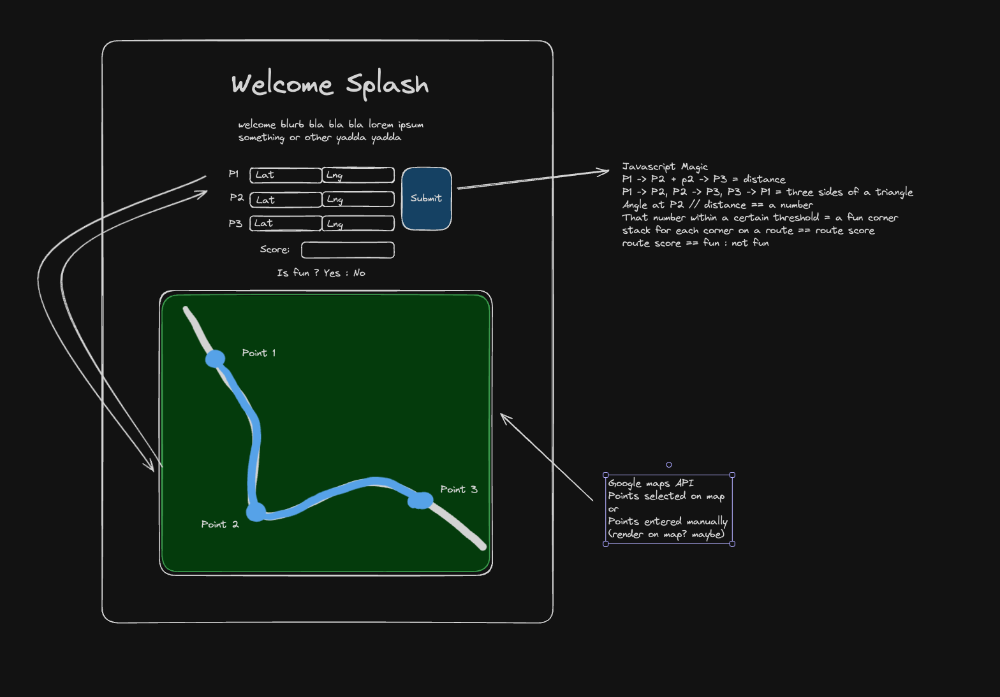

# Google Maps Route Scorer

### Overview
This project is meant to help me push the boundaries of my software engineering skillset, and increase my familiarity with the MERN stack.
The **Google Maps Route Scorer** is a tool designed to evaluate the "fun factor" of a given route based on its curvature. Inspired by the joy of finding scenic and twisty roads, this project leverages Google Maps data to provide an interactive, intuitive way to score routes.

### Features
- **Curvature Analysis**: Calculates the curvature of each segment along a polyline route.
- **Fun Score Calculation**: Computes a "fun score" based on customizable parameters.
- **Interactive Map Visualization**: Displays the route on an interactive Google Map.
- **Dynamic Input for Points**: Allows the user to input specific points to analyze.

### Technologies Used
- **Frontend**:
  - React
  - Google Maps API
  - React Spinners for Loading Indicators

- **Backend**:
  - Node.js
  - Express

- **Algorithm**:
  - Custom curvature scoring algorithms implemented using JavaScript classes.

### Built With

[![React][React.js]][React-url] &nbsp;

[![Javascript][Javascript.com]][Javascript-url] &nbsp;
